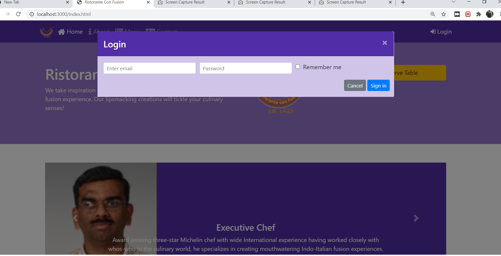

<h1> Introduction </h1>

Risorante is the restarurant website. It is build using HTML CSS javascript bootstrap and node js. It's main purpose is to provide the information of dish available to the customer, 
provide contact and address of the restaurant etc. This is basically coursera project which i successfully completed.

<h1> Tools and language used </h1>

 HTML CSS javascript jquery pooper js bootrstap VScode node js 

<h1> User Interface </h1>

<h2> Home page </h2>

<h2> login modal </h2>

     
     <h2> Reserve table modal </h2>

<h2> About page </h2>

<h2> Contact page</h2>

